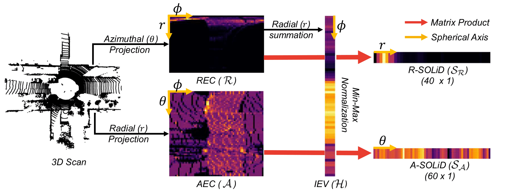

## What is the SOLiD?
* SOLiD is a lightweight and fast LiDAR global descriptor for FOV constraints situations that are limited through fusion with other sensors or blocked by robot/sensor operators including mechanical components or solid-state LiDAR (e.g. Livox).
  <p align="center"></p>

## How to use the SOLiD pipeline?
```
$ git clone https://github.com/sparolab/solid.git
$ make
$ solid_pipeline --dataloader mulran --config <path-to-config>  <path-to-mulran-root> <path-to-results-dir>
```
  
## Citation
  ```
	@article{kim2024narrowing,
	  title={Narrowing your FOV with SOLiD: Spatially Organized and Lightweight Global Descriptor for FOV-constrained LiDAR Place Recognition},
	  author={Kim, Hogyun and Choi, Jiwon and Sim, Taehu and Kim, Giseop and Cho, Younggun},
	  journal={IEEE Robotics and Automation Letters},
	  year={2024},
	  publisher={IEEE}
	}
  ```
